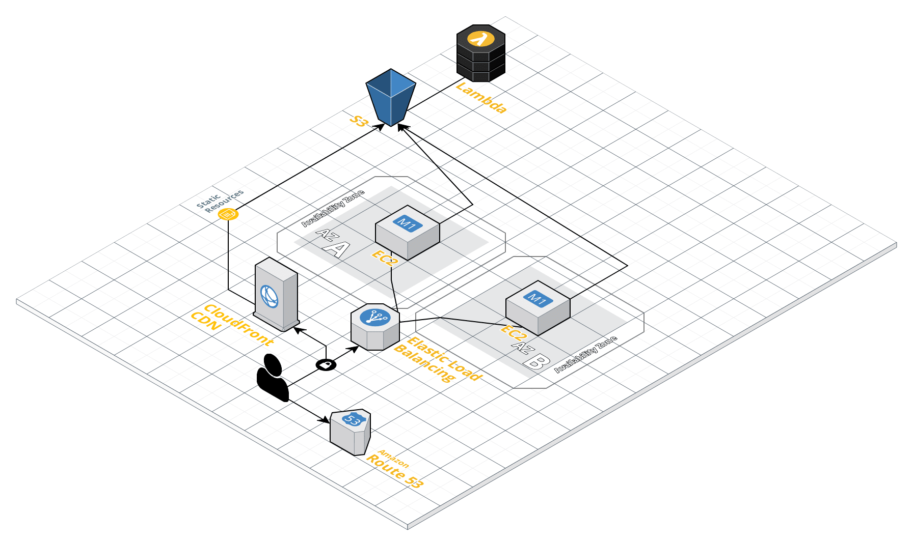

[Atividade 1: Arquitetura de Aplicação na AWS](https://github.com/miguelxvr/mx-aws-labs/wiki)

Tabela de Conteúdo:

1. [Criação de instâncias de máquinas virtuais no serviço AWS EC2](./1_Criando-uma-instância-de-máquina-virtual-do-EC2.md)
2. [Criação de bucket para armazenamento escalável no serviço AWS S3](./2_Criação-de-buckets-para-armazenamento-escalável-no-S3.md)
3. [Criação de tabela para armazenamento NoSQL no serviço AWS DynamoDB](./3_Criação-de-tabela-para-armazenamento-NoSQL-no-DynamoDB.md)
4. [Criação de funções serverless usando o serviço AWS Lambda](./4_Criação-de-funções-serverless-usando-AWS-Lambda.md)
5. [Criação de balanceador de cargas para aplicação disponível e escalável (Opcional)](./5_Criação-de-balanceador-de-cargas-para-aplicação-escalável.md)
6. [Descrever Instância EC2, DynamoDB e S3 via Terraform](./6_Descrever%20EC2,%20DynamoDB%20e%20S3%20via%20Terraform.md)

Arquitetura de referência:

